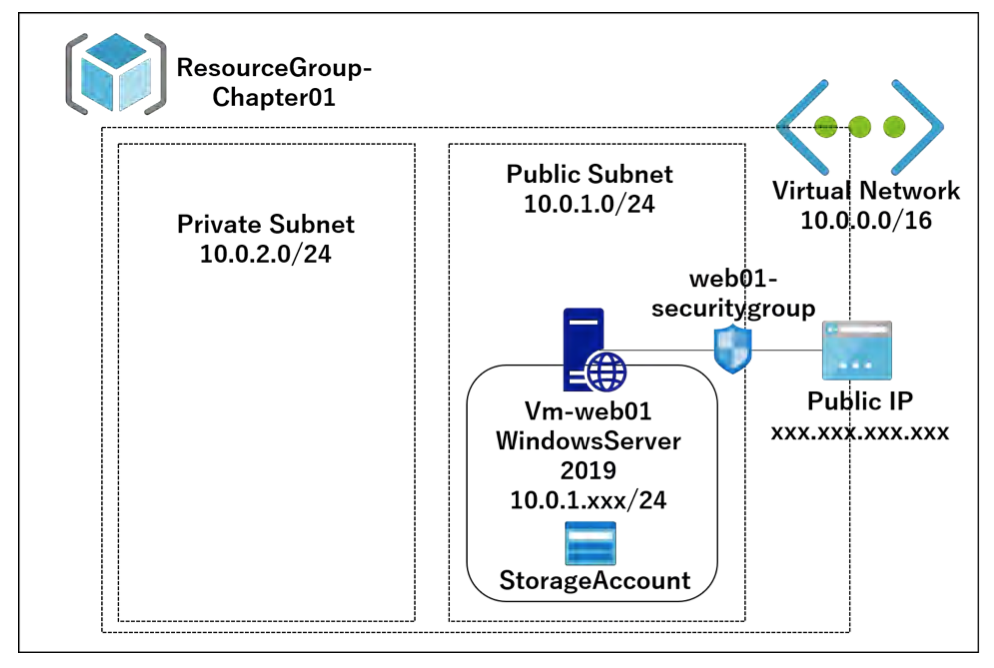
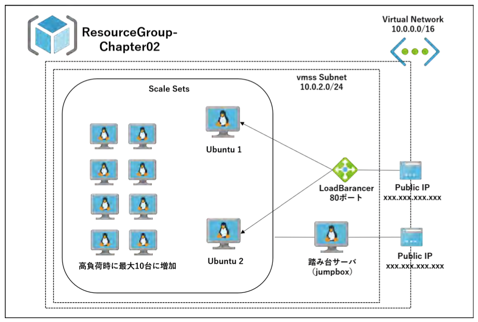

# Azure Terraformers
### 概要
参考書を片手にハンズオン
- まずは触ってみる
- Terraformコードでインフラを眺めてみる
- AWSとの共通点、違いを意識する 

上記を念頭に０→１のつもりで学習。

### 1. 開発環境
```
azure-cli        2. 7.0
Terraform        0.12.5
MacOS catalina  10.15.3
```
<br><br>

### 2. ファイル構成
```
.
├── Readme.md
├── chapter-01
│   ├── backend.tf
│   ├── network.tf
│   ├── outputs.tf
│   ├── provider.tf
│   ├── resourcegroup.tf
│   ├── variables.tf
│   ├── vm_web.tf
│   └── web01.rdp
├── chapter-02
│   ├── customautoscale.tf
│   ├── jumpbox.tf
│   ├── outputs.tf
│   ├── provider.tf
│   ├── resoursegroup.tf
│   ├── variables.tf
│   ├── vmss.tf
│   └── web.conf
└── markdown
```
<br><br>

### 3.1 chapter-01

1. Terraform用サービスプリンシパル（AWS：IAMロール）
2. リソースグループ（AWS：Tag）
3. 仮想ネットワーク（AWS：VPC）
4. パブリックサブネット・プライベートサブネット
5. リモートデスクトップ用仮想マシン（Windowsサーバー）
6. Webサーバー（IIS）
7. AzureStorageでtfstateファイルの管理
<br><br>

### 3.2 chapter-02

1. リソースグループ
2. 仮想ネットワーク
3. パブリックサブネット
   
4. HTTP
   -  ロードバランサー
   -  仮想マシン（Ubuntu）
   -  Webサーバー（Nginx）
      -> cloud-init
   -  オートスケール設定
      -> stressツールで確認
5. SSH
   - 踏み台サーバー
<br><br>

### 参考
ネット書籍  Azure Terraformer
