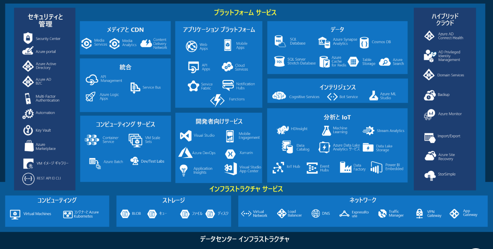
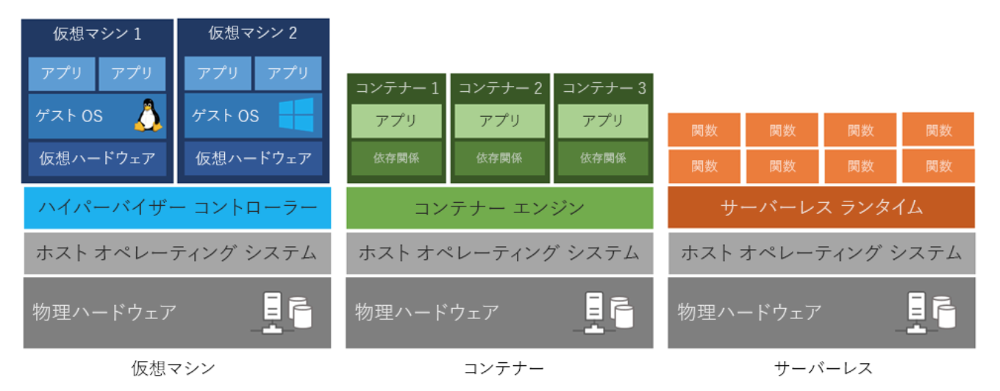
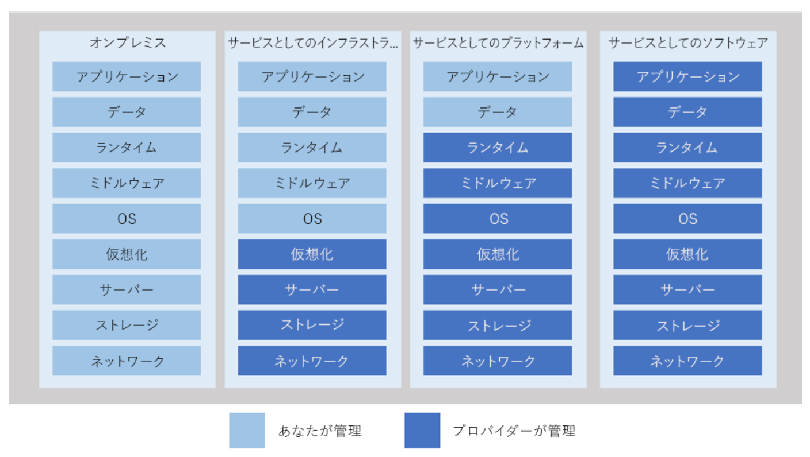
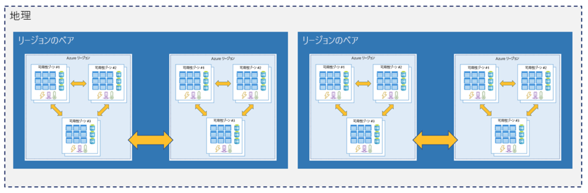

# Kvit training
## サービス一覧

https://docs.microsoft.com/ja-jp/learn/modules/welcome-to-azure/3-tour-of-azure-services

## コンピューティング

https://docs.microsoft.com/ja-jp/learn/modules/principles-cloud-computing/2-what-is-cloud-computing

## as a Service


## リージョンのペア

https://docs.microsoft.com/ja-jp/learn/modules/explore-azure-infrastructure/5-region-pairs

## VMの作成
- Azure Clund Shell
```
$ ssh-keygen -t rsa -b 4096
  Enter -> passphrase -> passphrase

# Linux VMにSSHキーを追加
$ ssh-copy-id -i ~/.ssh/id_rsa_pub <ユーザー名>@<サーバーip>
```

## Disk
```
- オペレーティング システム ストレージ
  すべての VM に 1 つ含まれるディスク
  SATA ドライブとして登録、Windows では C: ドライブとしてラベル付け、Unix 系オペレーティング システムでは "/" としてマウント
  最大容量は 2,048 ギガバイト (GB) で、そのコンテンツは、VM を作成するときに使用した VM イメージから取得

- 一時ストレージ
  ページ ファイルおよびスワップ ファイルに使用される一時 VHD
  このドライブのデータは、メンテナンス イベントまたは再デプロイ中に失われる可能性があり
  Windows VM では既定で D: のラベル
  失いたくない重要データは、このドライブに格納しない

- データ ストレージ
  VM に接続されている他のディスクはすべて、データ ディスク
  データ ディスクを使用して、再起動後も保持する必要があるファイル、データベース、およびその他のデータを格納
  一部の VM イメージには、既定でデータ ディスクが含む
  各データ ディスクは SCSI ドライブとして登録され、最大容量は 4,095 GB
  データ ドライブ用にドライブ文字またはマウント ポイントを選択可
```
https://docs.microsoft.com/ja-jp/learn/modules/add-and-size-disks-in-azure-virtual-machines/2-add-data-disks-to-azure-virtual-machines

```
# ディスクを特定
$ dmesg | grep SCSI

# 初期化する必要があるドライブ (sdc) がわかったら、fdisk を使用して行う
$ (echo n; echo p; echo 1; echo ; echo ; echo w) | sudo fdisk /dev/sdc

# mkfs コマンドを使ってパーティションにファイル システムを書き込む
$ sudo mkfs -t ext4 /dev/sdc1

# ファイル システムにドライブをマウントする必要があります。 data フォルダーを使用する
$ sudo mkdir /data && sudo mount /dev/sdc1 /data
```