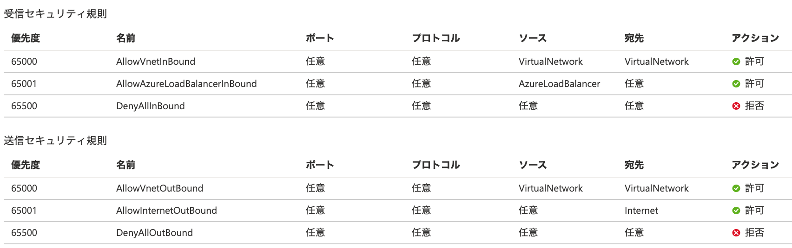
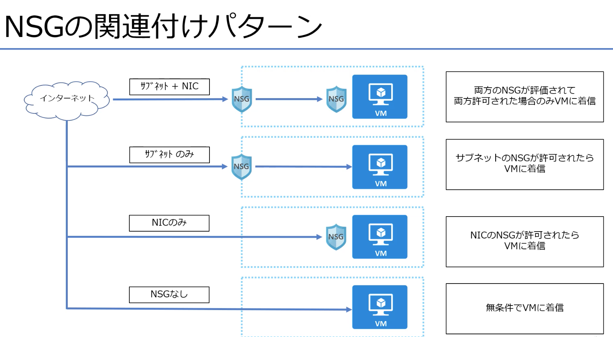
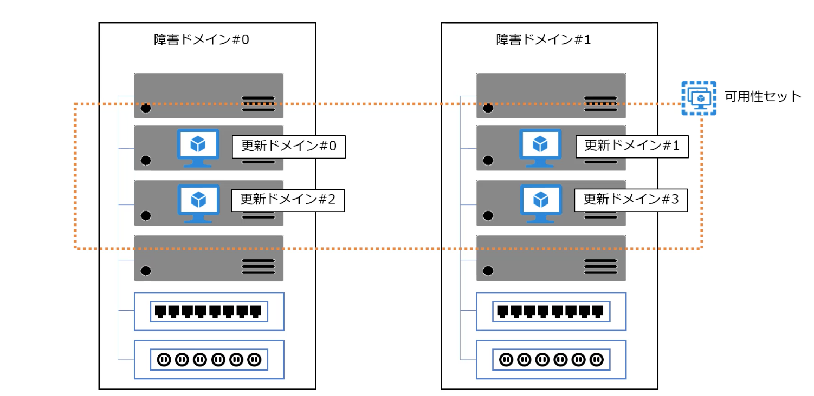
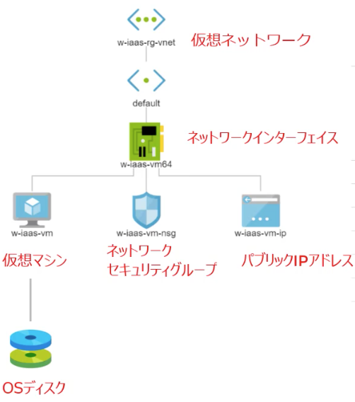
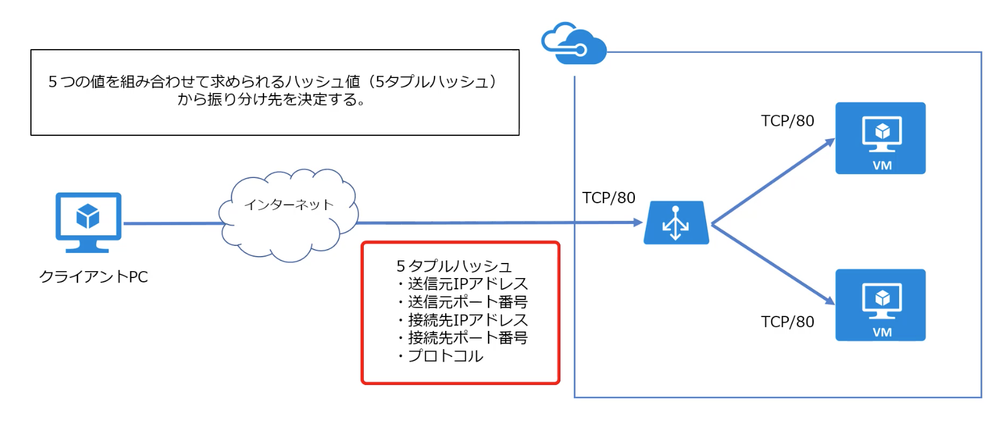
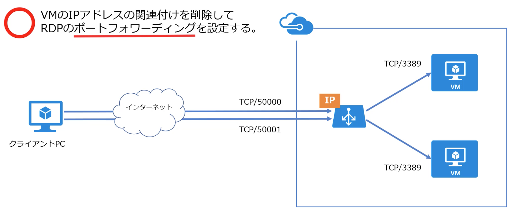
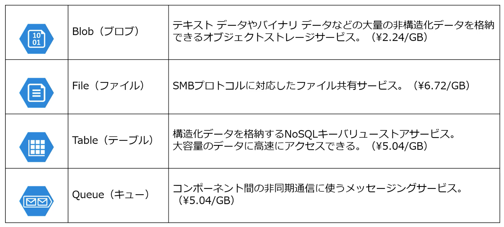
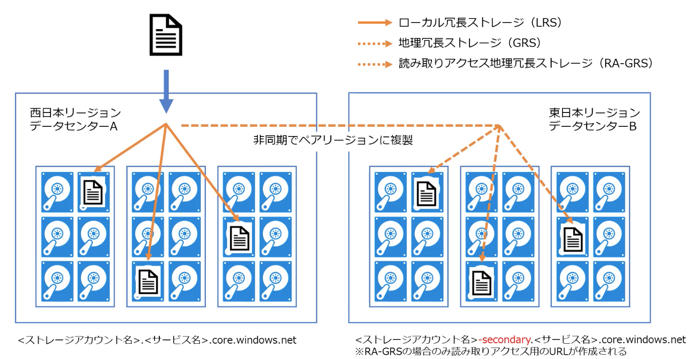

# Udemy study
- 仮想ネットワーク
- セキュリティグループ
- 可用性セット
- ストレージアカウント
- 仮想マシン

### 仮想ネットワーク(Vnet)
略

### セキュリティグループ(nsg)

追加ルールは100~4096の間で優先度を指定できる
3389 RDP


#### 可用性セット(alv)
- 障害ドメイン：電源やネットワーク機器を共有する範囲
- アップデートを同時に適用する範囲

あとから可用性セットに配置できないので注意！

#### ストレージアカウント
名前はユニークに。小文字と数字のみ。
パフォーマンス欄のPremiumは仮想マシンのディスク向け。

### 仮想マシン(vm)
```
image: [smalldisk]windows2016 Datacenter Gen1
disk : b2...
```

- NetworkWacherRG
自動的に作られる（無料）
仮想ネットワーク/監視/ダイアグラム/トポロシー（構成図）


- 日本語化
https://github.com/m-oka-system/udemy-azure-iaas/blob/master/doc/Chapter2.仮想マシンを作成してみよう.md

vm内でのsysprep: アカウント情報などを削除するイメージ作成の準備
```
<GUI>
ファイル名を指定して実行/ c¥windows¥system32¥sysprep
一般化するにチェック、シャットダウンオプションをシャットダウン→実行

<CUI>
C:\Windows\System32\sysprep\sysprep.exe /generalize /oobe /mode:vm /shutdown
```

### ロードバランサー

```
1. ロードバランサの作成（フロントエンドIPの構成）
   作成時に指定するIPアドレスが接続先になる
   SKU: Basic(無料)
2. バックエンドプールの追加
   負荷分散する対象VMを登録
3. 正常性プローブの追加
   バックエンドプールのVMの死活監視（異常であれば切り離す）
4. 負荷分散規則の追加
   待ち受けポートと転送先ポートのマッピングや、バックエンドプール・正常性プローブとの関連づけを行う
5. インバウンドNAT規則の追加
   RDP接続のポートフォワーディングの設定を行う

※ デフォルトではラウンドロビンではなく、５タプルなので注意
```
- DNS設定
```
全てのサービス/パブリックipアドレス/構成/DNS名入力 => リージョン毎にユニーク
```
- バックエンドプール設定(lb-backend)
```
ロードバランサー/バックエンドプール/仮想マシンで2台選択（現在は可用性セットの選択はできないので注意）
```
- 正常性プローブ設定(lb-probe)
```
ロードバランサー/正常性プローブ/設定

プロトコル
TCP : アクセスできるかどうかチェック
HTTP: ステータスコード200が返ってくるかチェック　指定パスにきちんとページがあることが大前提
```
- 負荷分散規則の追加(lb-rule)
```
バックエンドプールと正常性プローブをここで関連付けする

セッション永続化
なし＝５タプル
クライアントIP＝２タプル
クライアントIPとプロトコル＝３タプル
```
- 確認
```
IISの停止
stop   $ Stop-Service W3SVC
status $ Get-Service W3SVC
start  $ Start-Service W3SVC

ブラウザで確認しながらチェック
```
インバウンドNAT規則

```
lb経由でVMにRDP接続する為の設定

ロードバランサー/インバウンドNAT規則/
ex lb:vm1  50000:3389
   lb:vm2  50001:3389

RDP接続してPowerShellでhostnameコマンドで確認
```
ロードバランサーが繋がらない場合の問題の切り分け
https://www.syuheiuda.com/?p=4875


### Azure Storage
```
・名前は世界でユニーク
・blob, file, table, queueの4つのサービス
・ストレージアカウントを作成して各サービスを利用
　サービスに接続する為の一意のURLと紐づく
  http(s)://...<ストレージアカウント名>.<サービス名>.core.windows.netなど
  http(s)://...storage.blob.core.windows.netなど
```



- blob
```
ストレージアカウント/コンテナー/ブロブ

<コンテナ作成>
プライベート（匿名アクセスなし）
BLOB（BLOB専用の匿名読み取りアクセス）
→ これをONにするとtext.txtをブラウザで確認することができる　https://ストレージアカウント名.blob.core.windows.net/コンテナ名/blob名
コンテナー（コンテナとBLOBの匿名読み取りアクセス）
```
試しに作成したVMにAzure Storage Explorerをインストール
```
explorerで「Azure storage explorer」で検索
アカウント名とキーを設定して同期

※　空のフォルダは保持されないので消えてしまう。注意
```

### 仮想マシンスケールセット(vmss)
```
・スケジュールや負荷によって台数をスケールコントロール
・ロードバランサはStandard（有料）で作成される（※既存のロードバランサは選択不可）
```
```
<作成手順>
・VMSSを新規作成
・負荷分散オプションとしてロードバランサも合わせて作成
　（バックエンドプール・プローブなどは自動で構成される）
・可用性セットは自動で構成される
```

